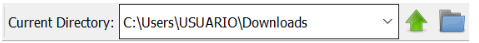

## Instalación básica
1. Acceder  a https://octave.org/download/,  y  buscar  el  instalador  para el  sistema  operativo propio. 
2. Para agregar funcionalidades nuevas al entorno numérico básico, existen los “packages”.
3. El paquete `control`, utilizado en este curso, está incluido por defecto en el bundle de Octave para Windows.

## Instalación de paquetes adicionales
Los paquetes oficiales pueden encontrarse en https://gnu-octave.github.io/packages/
### Instalación online
En la terminal de Octave correr `pkg install <url-del-paquete>`. Por ejemplo:
```
pkg install "https://github.com/gnu-octave/octave-arduino/releases/download/release-0.12.1/arduino-0.12.1.tar.gz"
```

### Instalación offline
1. Descargar el paquete deseado
2. Cambiar la dirección actuala la dirección en la que se encuentra el paquete  


3. Ejecutar en la terminal de Octave
```
pkg install [PAQUETE].tar.gz
```


## Carga de paquetes al iniciar Octave
Cada vez que se desea usar un paquete, se deberá cargar en el espacio de trabajo con
```
pkg load [PAQUETE]
```

### Cargar automáticamente el paquete al iniciarse Octave
En la dirección (por defecto) `C:\Octave\Octave-5.1.0.0\mingw64\share\octave\site\m\startup`, buscar el archivo `octaverc`, y editarlo:
```
## System-wide startup file for Octave.
##
## This file should contain any commands that should be executed each
## time Octave starts for every user at this site.
EXEC_PATH (cstrcat (fullfile (OCTAVE_HOME, 'notepad++'), pathsep, EXEC_PATH));
EXEC_PATH (cstrcat (fullfile (OCTAVE_HOME, 'bin'), pathsep, EXEC_PATH));
EDITOR (fullfile (OCTAVE_HOME, 'notepad++', 'notepad++.exe'));

## Added
clc;
pkg load control;
pkg load arduino;
```

**ATENCIÓN**: si la intención es compartir los archivos .m, debemos tener en cuenta que quien los recibe puede no tener los mismos paquetes instalados. Una buena manera de recordarlo puede ser la de iniciar todos los programas con `pkg load [paquete]`
